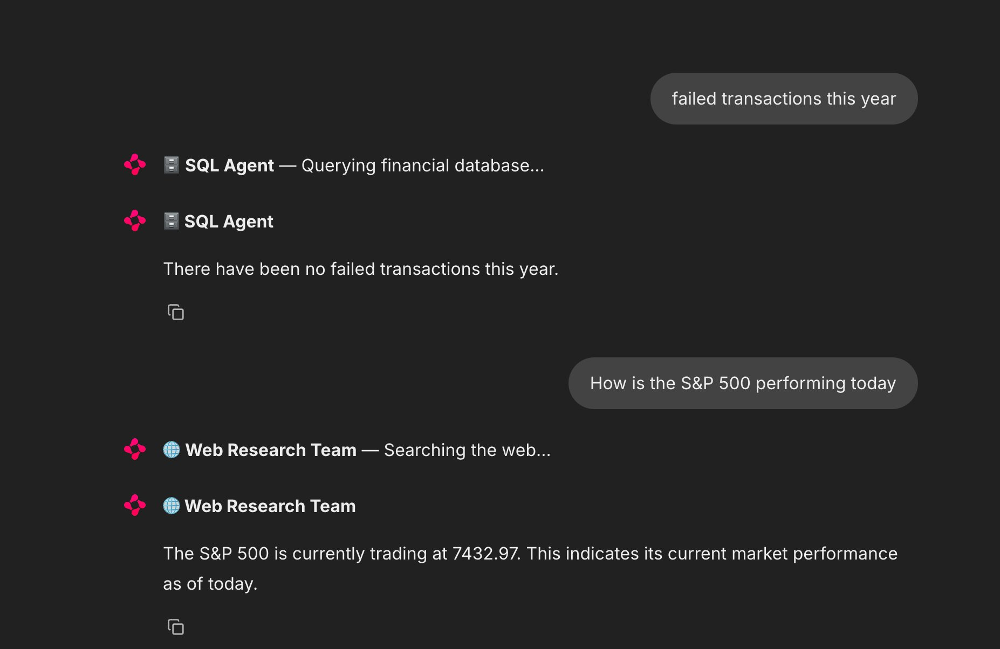
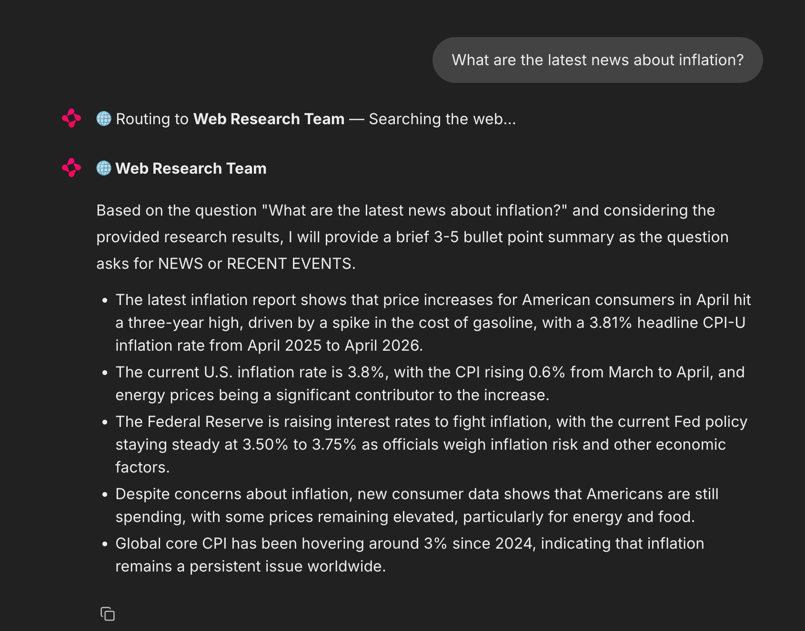
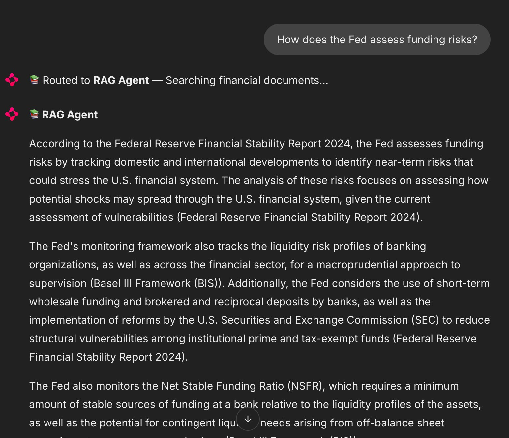
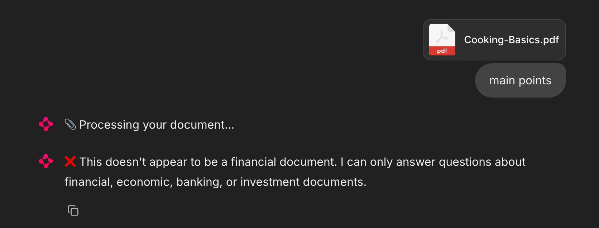
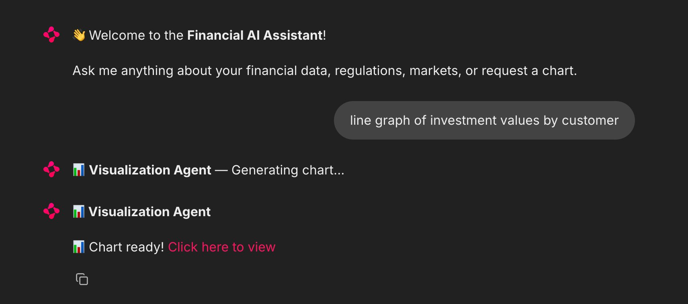
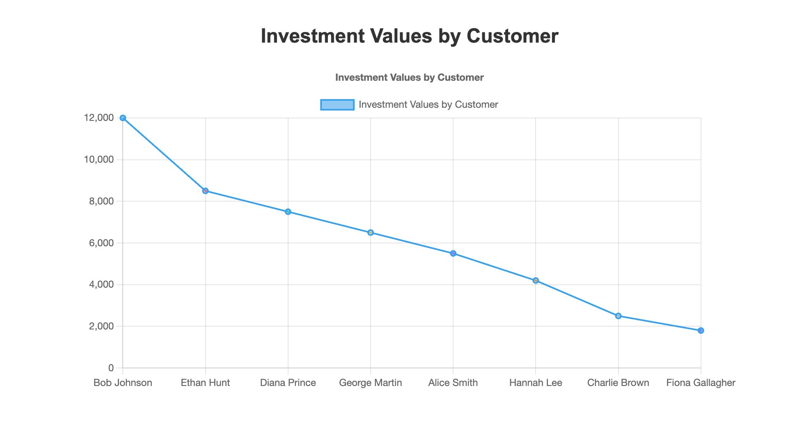
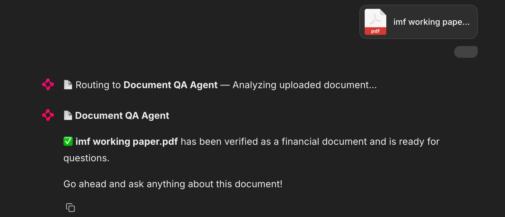
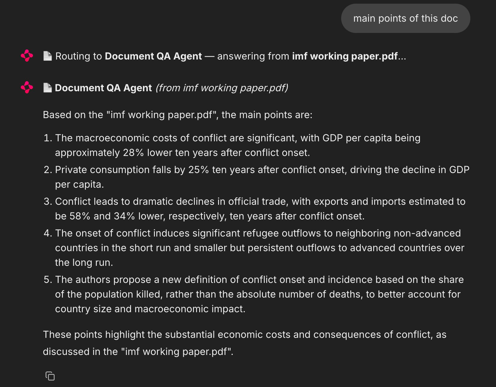
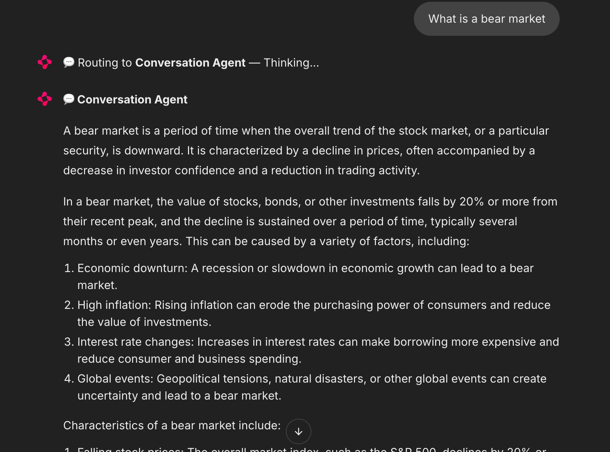
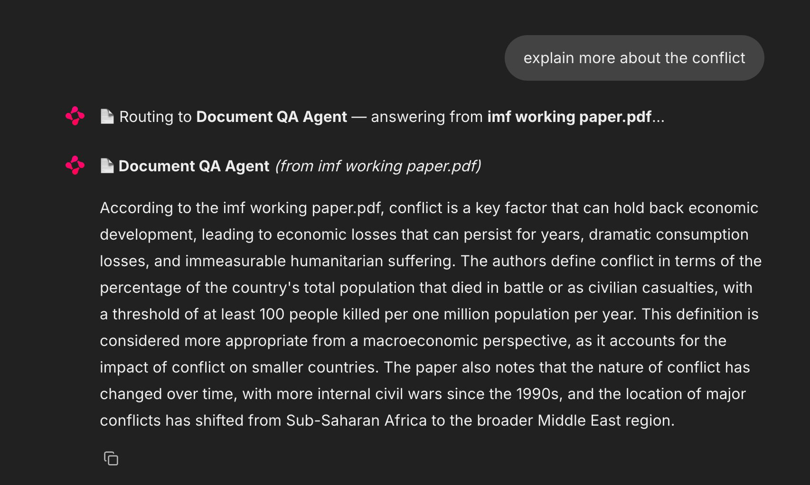

# Financial Services Multi-Agent System

AI assistant for financial services built with LangGraph, featuring 7 specialized agents coordinated by a central supervisor. The system handles database queries, document retrieval, web research, data visualization, uploaded document Q&A, and general financial Q&A through a single conversational interface powered by a ChainLit UI.

---

## Project Goal

Build a production-grade multi-agent system that can answer any financial question by routing it to the most appropriate specialized agent — whether the answer lives in a database, a regulatory document, the web, a user-uploaded PDF, or general LLM knowledge.

---

## Architecture

```
User Query / Uploaded PDF
    ↓
app.py (ChainLit UI — pre-routing + upload detection)
    ↓
┌──────────────────────────────────────────────────────────────┐
│  Document QA Agent  → user-uploaded financial PDFs           │  
└──────────────────────────────────────────────────────────────┘
    ↓ (if no upload)
Main Supervisor (routes to correct agent)
    ↓
┌──────────────────────────────────────────────────────────────┐
│  SQL Agent          → PostgreSQL financial database          │
│  RAG Agent          → indexed financial documents (FAISS)    │
│  Conversation Agent → general LLM knowledge                  │
│  Visualization Agent→ interactive Chart.js charts            │
│  Web Research Team  → live web search + reports              │
└──────────────────────────────────────────────────────────────┘
    ↓
Response returned to user via ChainLit UI
```

---

## Demo

All screenshots below are from the live ChainLit UI.

### SQL Agent — Database Queries
Querying failed transactions and live S&P 500 price in the same session, routed to different agents automatically.



---

### Web Research Team — Live Web Search
Latest inflation news fetched, synthesized, and returned as a structured bullet summary.



---

### RAG Agent — Financial Document Retrieval
Answering "How does the Fed assess funding risks?" by retrieving relevant chunks from indexed documents with inline citations.



---

### Conversation Agent — General Financial Q&A
Explaining what a bear market is using the LLM's built-in financial knowledge.



---

### Visualization Agent — Chart Generation
Generating a line chart of investment values by customer from the PostgreSQL database.





---

### Document QA Agent — PDF Upload & Verification
Uploading an IMF working paper PDF — verified as a financial document with a ready prompt for questions.



---

### Document QA Agent — Answering from Uploaded Document
Asking "main points of this doc" — answered directly from the uploaded IMF PDF with source attribution.



---

### Document QA Agent — Follow-up Questions (Session Memory)
Follow-up question "explain more about the conflict" answered from the same uploaded document without re-uploading.



---

### Document QA Agent — Non-Financial Document Rejection
Uploading a cooking PDF — correctly identified as non-financial and rejected with a clear message.



---

## Agents

### Main Supervisor
Routes every user query to the correct agent based on intent detection. Uses LLM-based classification to identify whether the query needs database data, document knowledge, live web search, a chart, or general explanation.

**Routing logic:**
- `sql` → questions about customers, accounts, transactions, loans, investments
- `rag` → questions about financial regulations, reports, or indexed documents
- `conversation` → general financial concepts, definitions, explanations
- `visualization` → any request mentioning chart, graph, plot, or visual
- `web_research` → current events, live prices, latest news, recent trends

---

### SQL Agent
Queries a PostgreSQL financial database using natural language. The LLM generates accurate SQL queries based on the user's question and returns results formatted in natural language with customer names resolved from IDs.

**Database schema:**
```
customers    (id, name, email, country, account_type)
accounts     (id, customer_id, balance, currency, status)
transactions (id, account_id, type, amount, date, status)
loans        (id, customer_id, amount, interest_rate, due_date, status)
investments  (id, customer_id, asset_name, amount_invested, current_value)
```

**Example queries:**
- "What is the total balance across all active accounts?"
- "How many customers have overdue loans?"
- "Show me all completed transactions"

---

### RAG Agent
Retrieves answers from indexed financial documents using FAISS vector store and HuggingFace embeddings (`all-MiniLM-L6-v2`). Uses `k=8` retrieval with a carefully tuned prompt to balance cross-document synthesis with hallucination prevention.

**Indexed documents:**
- JPMorgan Chase Annual Report 2023
- Federal Reserve Financial Stability Report (November 2024)
- Basel III Framework (BIS)
- IMF — The Macroeconomic Costs of Conflict (2020)
- IMF — Geopolitical Risks: Implications for Asset Prices (2025)

**Example queries:**
- "What is the minimum capital requirement under Basel III?"
- "What are the main vulnerabilities in the US financial system?"
- "What is the long term economic impact of civil war?"

---

### Conversation Agent
Handles general financial Q&A using the LLM's built-in knowledge. No tools, no retrieval — just the LLM with a financial system prompt and full conversation memory across turns.

**Example queries:**
- "What is compound interest?"
- "Explain the difference between stocks and bonds"
- "What does APR mean?"

---

### Visualization Agent
Generates interactive Chart.js charts from database data. Uses a two-step pipeline: LLM generates the SQL query from natural language, executes it, then LLM determines the chart type and column mapping dynamically from the actual results. Outputs self-contained HTML files served via a local HTTP server on port 8080.

**Supported chart types:** bar, line, pie, scatter, histogram

**Example queries:**
- "Show me a bar chart of account balances by customer"
- "Pie chart of loan status distribution"
- "Line chart of loan amounts by customer"

---

### Web Research Team (Subgraph)
A hierarchical subgraph of 3 agents that handles live web research:

**Researcher Agent** — runs 2 targeted web searches using SerpAPI (original query + financial analysis variant) and collects raw results.

**Report Writer Agent** — synthesizes raw research into a structured response. Automatically chooses the format based on query type:
- Simple fact → 1-2 sentence answer
- News/events → 3-5 bullet point summary
- Analysis/trends → full structured report (Executive Summary, Key Findings, Market Implications, Conclusion)

**Sub-Supervisor** — coordinates the researcher and report writer, manages the subgraph flow.

**Example queries:**
- "What is the current price of gold?"
- "What are the latest Fed interest rate news?"
- "What are the latest trends in AI investment in 2025?"

---

### Document QA Agent *(new)*
Handles user-uploaded PDF documents directly in the ChainLit UI. This agent operates outside the main supervisor — it intercepts file uploads before routing and manages its own session state.

**How it works:**
1. User attaches a PDF file in the chat (with or without a question)
2. Text is extracted from the PDF using PyMuPDF
3. LLM classifies the document: is it a financial document?
4. If **not financial** → returns a rejection message explaining what qualifies
5. If **financial** → stores the document in the session and answers the user's question (or prompts them to ask one)
6. Follow-up questions in the same session are automatically answered from the uploaded document
7. User can type "forget document", "clear", or "new document" to reset and return to normal routing

**What counts as a financial document:** annual reports, bank statements, financial statements, investment reports, loan agreements, regulatory filings, economic research papers, earnings reports, budget documents, insurance policies, tax documents, financial regulations.

**Implementation:** `agents/doc_qa_agent.py` — standalone module with three functions:
- `extract_text_from_pdf(file_path)` — PyMuPDF text extraction
- `is_financial_document(text)` — LLM-based yes/no classification on first 3,000 characters
- `answer_from_document(question, doc_text, filename)` — grounded Q&A on up to 12,000 characters of document content

**Example usage:**
- Upload a bank statement PDF → "What is my total spending this month?"
- Upload an earnings report → "What was the net income?"
- Upload a loan agreement → "What is the interest rate and repayment schedule?"

---

## ChainLit UI

The application runs on ChainLit (`app.py`), providing a chat interface with:

- **Agent routing indicators** — shows which agent is handling each query before the response arrives
- **Chart links** — visualization results are served via a local HTTP server (port 8080) and linked directly in chat
- **RAG source attribution** — document answers include clickable source links at the bottom
- **PDF upload support** — drag-and-drop or attach PDFs for on-demand document Q&A
- **Session memory** — uploaded documents persist across follow-up questions within the same chat session

**Run the UI:**
```bash
chainlit run app.py
```

---

## Project Structure

```
multi-agent system/
├── config.py                      # shared LLM initialization (ChatGroq)
├── utils.py                       # shared database utility (run_sql_query)
├── supervisor.py                  # main graph, routing, compiled app
├── app.py                         # ChainLit UI + upload handling
├── .env                           # API keys
├── database/
│   ├── create_db.py               # PostgreSQL setup and seed data
│   └── faiss_index/               # saved FAISS vector store
├── agents/
│   ├── sql_agent.py               # SQL tool + agent node
│   ├── rag_agent.py               # FAISS loader + RAG chain + agent node
│   ├── conversation_agent.py      # LLM agent node with memory
│   ├── visualization_agent.py     # Chart.js HTML generator + agent node
│   ├── doc_qa_agent.py            # PDF upload handler: classify + Q&A
│   └── web_research/
│       ├── __init__.py
│       ├── researcher.py          # SerpAPI search node
│       ├── report_writer.py       # report synthesis node
│       └── sub_supervisor.py      # web research subgraph
├── rag-docs/                      # financial PDFs for RAG indexing
└── charts/                        # generated Chart.js HTML files
```

---

## Setup

### Prerequisites
- Python 3.11+
- PostgreSQL 16

### Installation

```bash
python3.11 -m venv venv
source venv/bin/activate
pip install langchain langchain-groq langchain-community langgraph \
            langsmith python-dotenv psycopg2-binary pymupdf \
            langchain-huggingface faiss-cpu sentence-transformers \
            torch google-search-results chainlit
```

### Environment Variables

Create a `.env` file in the root:

```
GROQ_API_KEY=your-groq-api-key
LANGSMITH_API_KEY=your-langsmith-api-key
LANGSMITH_TRACING=true
LANGCHAIN_PROJECT=financial-multi-agent
SERPAPI_API_KEY=your-serpapi-api-key
```

### Database Setup

```bash
# create PostgreSQL database
psql postgres
CREATE DATABASE financial_db;
CREATE USER financial_user WITH PASSWORD 'yourpassword';
GRANT ALL PRIVILEGES ON DATABASE financial_db TO financial_user;
\q

# populate with sample data
cd database
python3 create_db.py
```

### Build FAISS Index

Download the 5 financial PDFs into `rag-docs/` and run the exploration notebook (`rag-testing.ipynb`) to build and save the FAISS index to `database/faiss_index/`.

### Run

```bash
# With ChainLit UI (recommended)
chainlit run app.py

# CLI only (no UI)
python3 supervisor.py
```

---

## Tech Stack

| Category | Tool |
|----------|------|
| LLM Provider | Groq (llama-3.3-70b-versatile) |
| Agent Framework | LangGraph |
| UI | ChainLit |
| Database | PostgreSQL 16 |
| Vector Store | FAISS |
| Embeddings | HuggingFace all-MiniLM-L6-v2 |
| PDF Parsing | PyMuPDF (fitz) |
| Web Search | SerpAPI |
| Visualization | Chart.js (HTML files via local HTTP server) |
| Monitoring | LangSmith |
| Language | Python 3.11 |

---

## LangSmith Tracing

All agent runs are automatically traced in LangSmith under the `financial-multi-agent` project. Each run shows the full execution path including which agent was selected, tool calls made, tokens used, and response latency. Note: Document QA agent calls bypass the LangGraph supervisor and are not traced through LangSmith.

---


## Known Limitations

- Visualization agent generates HTML files served via local HTTP server — not embedded inline in ChainLit
- RAG answers limited to the 5 indexed documents — expanding the document set improves coverage
- Database contains sample data — production deployment would connect to a live financial database
- Document QA agent classification uses the first 3,000 characters — edge cases with non-financial preambles on financial documents may misclassify
- Only PDF uploads are supported for document Q&A; other file types (docx, xlsx) are not handled
